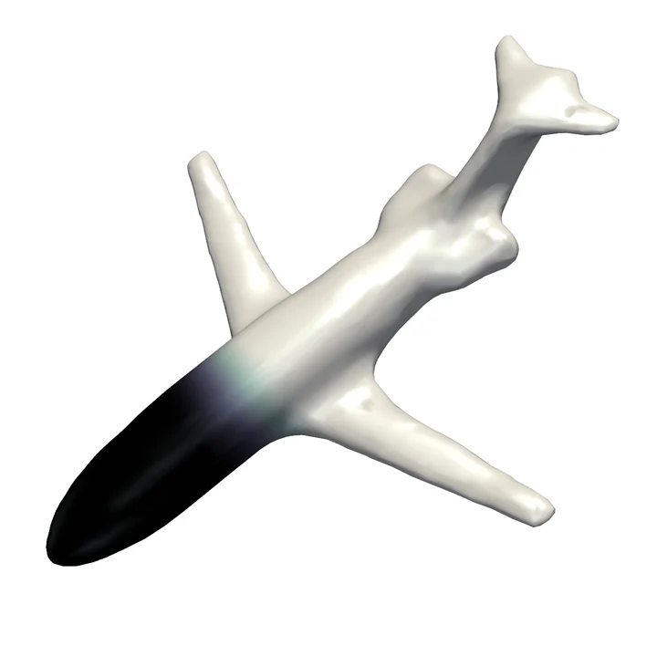
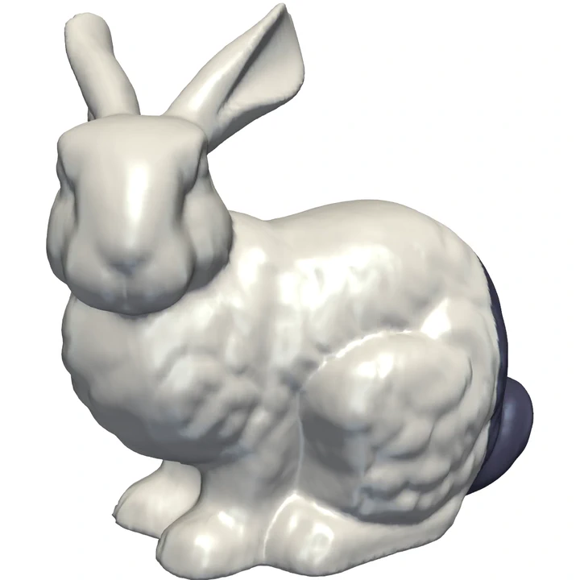
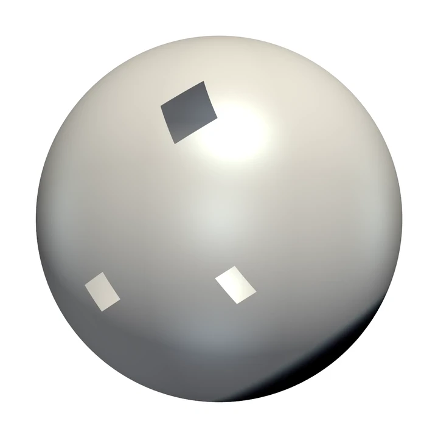
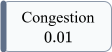
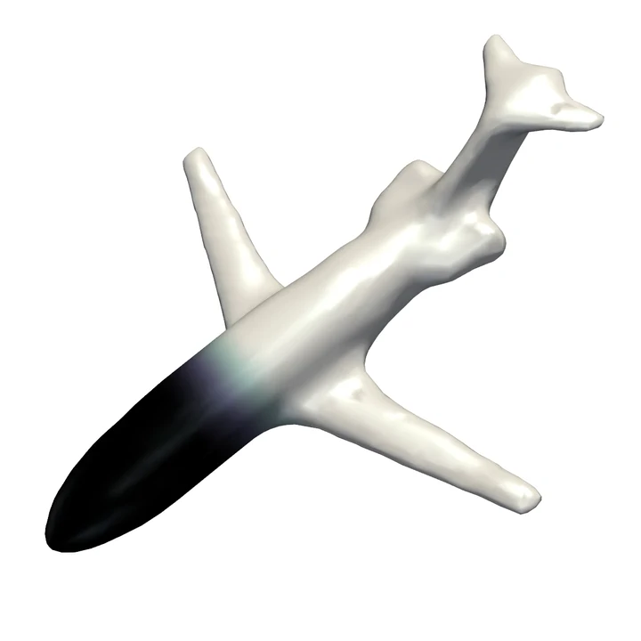
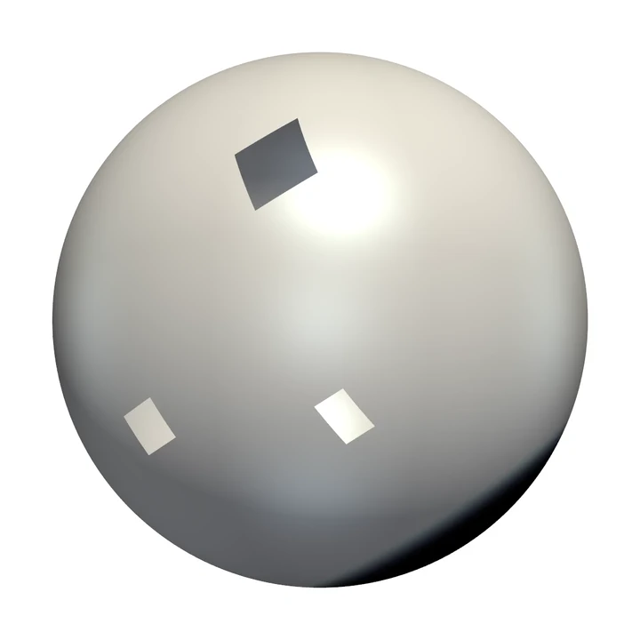

# DOTs-SOCP

[](https://arxiv.org/abs/2506.08988) [](LICENSE.txt) [](https://www.python.org/)

<p>
  
  
  
  
  
</p>

<p>
  
  
  
  
  
</p>

**DOTs-SOCP** solves dynamic optimal transport problems on general smooth surfaces with a Second-Order Cone Programming (SOCP) formulation and using an inexact semi-proximal augmented Lagrangian method.

This repository contains the official implementation of the paper:

> Liang Chen, Youyicun Lin, and Yuxuan Zhou.
> **An efficient augmented Lagrangian method for dynamic optimal transport on surfaces based on second-order cone programming**.
> [arXiv:2506.08988](https://arxiv.org/abs/2506.08988), 2025.

## Installation

Using `uv` is recommended.

1. Install `uv` (if not already installed) using:

    ```bash
    pip install uv
    ```
  
2. Synchronize Python virtual environment using:
    - **Windows:**

        ```bash
        uv sync --extra windows
        ```

    - **Linux:**

        ```bash
        uv sync --extra linux
        ```

Alternatively, using `pip`.

1. Create a Python 3.12 virtual environment:

    ```bash
    python -m venv .venv
    ```

2. Activate the environment:
    - **Windows:**

        ```bash
        .venv/Scripts/activate
        ```

    - **Linux:**

        ```bash
        source .venv/bin/activate
        ```

3. Install dependencies using pip:
    - **Windows:**

        ```bash
        pip install -r requirements_windows.txt
        ```

    - **Linux:**

        ```bash
        pip install -r requirements_linux.txt
        ```

On Linux systems without graphics support, install OpenGL/Mesa dependencies before rendering:

```bash
sudo apt-get update
sudo apt-get install -y libosmesa6-dev libgl1-mesa-dev
```

## Quick Start

Show an interactive demo:

```bash
python demo.py --example=airplane --show
```

Save animation frames and videos:

```bash
python demo.py --example=airplane --save --outdir=output/demo
```

For all available options, use the CLI:

```bash
python -m dot_surface_socp.cli --help
```

## One-Click Replication

The paper experiments are available through the one-click command:

```bash
make all
```

This command will reproduce experiments and save the results in the `output/` directory.
For more details, run

```bash
make help
```

On Windows, install `make` first if needed:

```powershell
winget install GnuWin32.Make
```

## Citation

If you use this code in your research, please cite:

- Liang Chen, Youyicun Lin, and Yuxuan Zhou. An efficient augmented Lagrangian method for dynamic optimal transport on surfaces based on second-order cone programming. arXiv:2506.08988, 2025.

## Contact

- E-mail: [chl@hnu.edu.cn](mailto:chl@hnu.edu.cn)
- Home page: [https://grzy.hnu.edu.cn/site/index/chenliang3](https://grzy.hnu.edu.cn/site/index/chenliang3)

## Copyright

**DOTs-SOCP** is distributed under the GNU Affero General Public License, version 3. See [`LICENSE.txt`](LICENSE.txt).

---
Thank you for your interest in our work on Dynamic Optimal Transport.
We hope this repository serves as a valuable resource for furthering research in this area.
